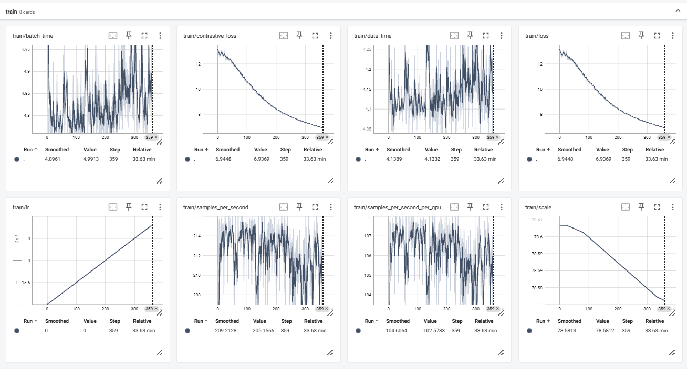
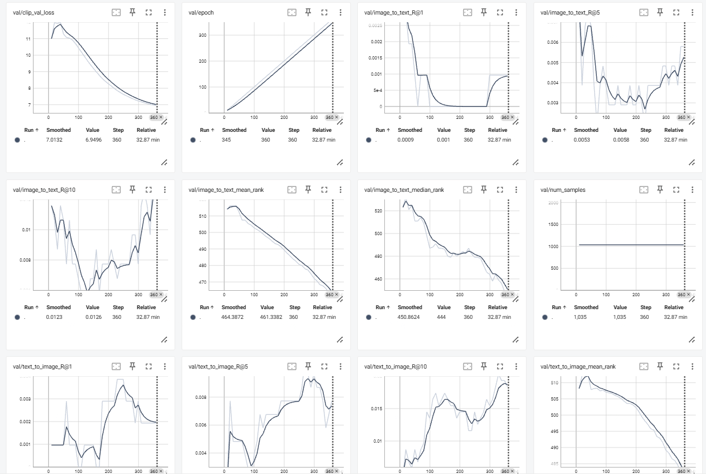
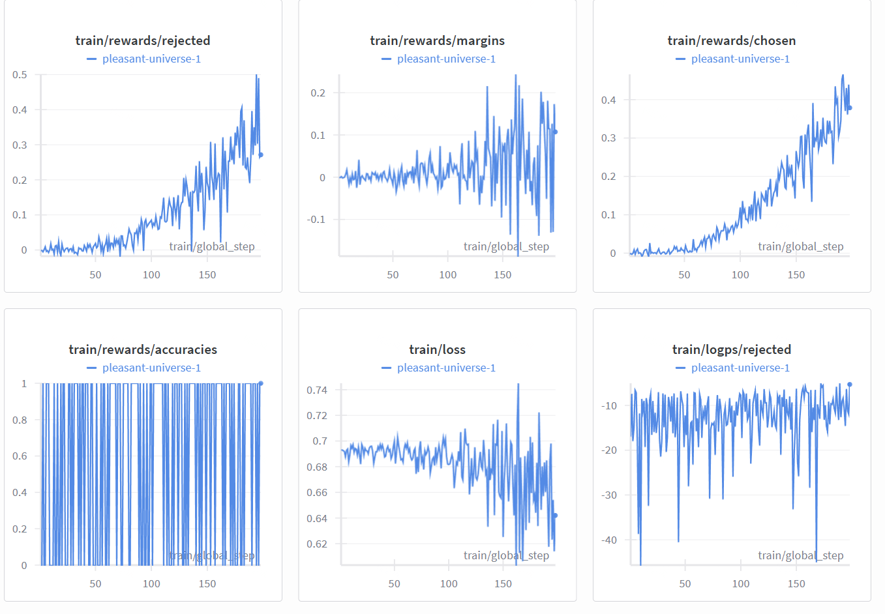

# RULE
Implementation (unofficial) of the paper "RULE: Reliable Multimodal RAG for Factuality in Medical Vision Language Models".

This repository provides an **unofficial reproduction** of the method proposed in
**[*RULE: Reliable Multimodal RAG for Factuality in Medical Vision Language Models*]** ([\[arXiv link](https://arxiv.org/pdf/2407.05131)]), focusing on replicating the reported performance on the **IU X-Ray** benchmark.

Using the released training protocol and carefully matched configurations, this implementation is able to **largely reproduce the reported IU X-Ray results**.

* **Original paper**: [[arXiv link](https://arxiv.org/pdf/2407.05131)]
* **Original codebase**: [[GitHub link](https://github.com/richard-peng-xia/RULE)]

---

## 1. Environment Setup

```bash
pip install -r requirements.txt
```

Due to the tight coupling between **LLaVA**, **Transformers**, and related libraries, version mismatches may occur.
We strongly recommend using the following verified versions:

```text
transformers==4.38.0
triton==2.2.0
trl==0.8.6
peft==0.10.0
accelerate==0.28.0
tokenizers==0.15.2
```

For LLaVA:

```text
llava==1.2.2.post1
```

> This version is confirmed to be runnable in our setup, although newer versions may also work with minor adjustments.

---

## 2. Required Pretrained Weights

Before training, please ensure the following pretrained checkpoints are available:

1. **Vision Tower**

   * `openai/clip-vit-large-patch14-336`

2. **Base Multimodal LLM**

   * `llava-med-v1.5-mistral-7b`

3. **Additional CLIP Backbone**

   * `thaottn/OpenCLIP-resnet50-CC12M` (from Hugging Face Hub)

All models can be downloaded automatically via Hugging Face unless otherwise specified.

---

## 3. Stage I: CLIP Alignment Training

The first stage aligns the vision encoder with the language model.

```bash
bash scripts/ours_ft_clip.sh
```

This stage corresponds to the **CLIP alignment / warm-up training** described in the paper.



---

## 4. Stage II: Preference Data Construction

For preference-based optimization, we directly use the prepared IU X-Ray alignment data:

```text
./data/training/alignment/iuxray.json
```

No additional preprocessing is required.

---

## 5. Stage III: DPO Training

Direct Preference Optimization (DPO) is performed in the third stage:

```bash
bash scripts/ours_ft_clip.sh
```



> Ensure that the DPO training directory does **not** include unnecessary LLaVA source folders to avoid runtime conflicts.

---

## 6. Inference and Evaluation

### 6.1 Retrieval Test Data Construction

```bash
bash scripts/ours_re_clip.sh
```

### 6.2 Inference

```bash
bash scripts/ours_test.sh
```

### 6.3 Metric Computation

```bash
python eval.py output_iuxray_test.jsonl
```

---

## 7. Reproduced Results on IU X-Ray

| Metric    | Value  |
| --------- | ------ |
| Accuracy  | 0.8749 |
| Precision | 0.7145 |
| Recall    | 0.8850 |
| F1-score  | 0.7906 |

These results are **largely consistent with the reported performance** in the original paper.

---

## 8. Released Weights and Resources

* **CLIP-aligned weights**: [Link 1]
* **LoRA weights (DPO)**: [Link 2]
* **Additional data / configs**: [Link 3]

---

## 9. Common Issues and Troubleshooting

### 9.1 `ModuleNotFoundError: llava`

**Solution**

```bash
export PYTHONPATH=/data02/users/ysc/RULE:$PYTHONPATH
```

---

### 9.2 LLaVA–Transformers Version Conflict

* Usually **non-fatal**
* A slightly newer `transformers` version may also work

---

### 9.3 Mistral Configuration Errors

**Solution**

* Adjust or downgrade `transformers` to a compatible version

---

### 9.4 `UnboundLocalError: local variable 'model' referenced before assignment`

**Recommendation**

* Ensure the DPO fine-tuning directory does **not** include extra `llava/` source folders

---

### 9.5 `AttributeError: 'NoneType' object has no attribute 'image_mean'`

**Recommendation**

* Use the **original LLaVA-Med folder**
* If downloading manually, ensure the directory name contains both `llava` and `mistral`

---

### 9.6 Slow or Failed Weight Download

```bash
export HF_ENDPOINT=https://hf-mirror.com
```

---

## 10. Citation

If you find this reproduction useful, please cite the original paper:

```bibtex
@article{xia2024rule,
  title={RULE: Reliable Multimodal RAG for Factuality in Medical Vision Language Models},
  author={Xia, Peng and Zhu, Kangyu and Li, Haoran and Zhu, Hongtu and Li, Yun and Li, Gang and Zhang, Linjun and Yao, Huaxiu},
  journal={arXiv preprint arXiv:2407.05131},
  year={2024}
}
```
